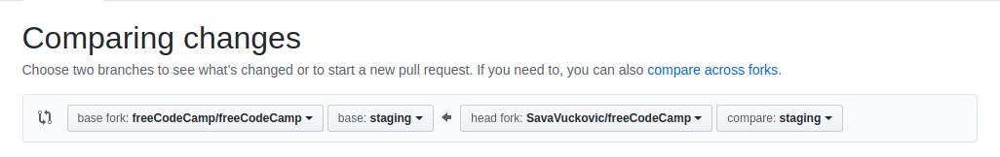

# Contributor's Guide

We welcome pull requests from freeCodeCamp campers (our students) and seasoned JavaScript developers alike! Follow these steps to contribute:

1. Find an issue that needs assistance by searching for the [Help Wanted](https://github.com/freeCodeCamp/freeCodeCamp/labels/help%20wanted) tag.

2. Let us know you are working on it by posting a comment on the issue.

3. Follow the [Contribution Guidelines](#contribution-guidelines) to start working on the issue.

Remember to feel free to ask for help in our [Contributors](https://gitter.im/FreeCodeCamp/Contributors) Gitter room.

Working on your first Pull Request? You can learn how from this *free* series [How to Contribute to an Open Source Project on GitHub](https://egghead.io/series/how-to-contribute-to-an-open-source-project-on-github)

###### If you've found a bug that is not on the board, [follow these steps](README.md#found-a-bug).

--------------------------------------------------------------------------------
## Quick Reference

|command|description|
|---|---|
| `npm run test` |  run all JS tests in the system, including client, server, lint and challenge tests |
| `npm run test-challenges` | run all challenge tests (for each challenge JSON file, run all `tests` against all `solutions`) |
| `npm run seed` <br>&nbsp;&nbsp;(<small>or</small> `node seed`) | parses all the challenge JSON files and saves them into MongoDB (code is inside [seed/index.js](seed/index.js)) |
| `npm run commit` | interactive tool to help you build a good commit message |
| `npm run unpack` | extract challenges from `seed/challenges` into `unpacked` subdirectory, one HTML page per challenge - see [Unpack and Repack](#unpack-and-repack) |
| `npm run repack` | repack challenges from `unpacked` subdirectory into `seed/challenges` |


## Table of Contents

### [Setup](#setup)
- [Prerequisites](#prerequisites)
- [Forking the Project](#forking-the-project)
- [Create a Branch](#create-a-branch)
- [Set Up Linting](#set-up-linting)
- [Set Up MailHog](#set-up-mailhog)
- [Set Up freeCodeCamp](#set-up-freecodecamp)

### [Make Changes](#make-changes)
- [Unpack and Repack](#unpack-and-repack)
- [Challenge Template](#challenge-template)
- [Run The Test Suite](#run-the-test-suite)

### Submit
- [Creating a Pull Request](#creating-a-pull-request)
- [Common Steps](#common-steps)
- [How We Review and Merge Pull Requests](#how-we-review-and-merge-pull-requests)
- [How We Close Stale Issues](#how-we-close-stale-issues)
- [Next Steps](#next-steps)
- [Other Resources](#other-resources)

## Setup
### Prerequisites

| Prerequisite                                | Version |
| ------------------------------------------- | ------- |
| [MongoDB Community Server](https://docs.mongodb.com/manual/administration/install-community/) | `~ ^3`  |
| [MailHog](https://github.com/mailhog/MailHog) | `~ ^1` |
| [Node.js](http://nodejs.org)                | `~ ^8.9.3`  |
| npm (comes with Node)                       | `~ ^5`  |

> _Updating to the latest releases is recommended_.

If Node.js or MongoDB is already installed on your machine, run the following commands to validate the versions:

```shell
node -v
mongo --version
```

To check your MongoDB version on Windows, you have to locate the installation directory. It is probably located at something like `C:\Program Files\MongoDB\Server\3.4\` where 3.4 is your version number.

If your versions are lower than the prerequisite versions, you should update.

Platform-specific guides to setting up a development environment:
- [How to clone and setup the freeCodeCamp website on a Windows pc](https://forum.freecodecamp.org/t/how-to-clone-and-setup-the-free-code-camp-website-on-a-windows-pc/19366)
- [How to Clone and Setup the freeCodeCamp Website on a Mac](https://forum.freecodecamp.org/t/how-to-clone-and-setup-the-freecodecamp-website-on-a-mac/78450)

### Forking the Project

#### Setting Up Your System

1. Install [Git](https://git-scm.com/) or your favorite Git client.
2. (Optional) [Setup an SSH Key](https://help.github.com/articles/generating-an-ssh-key/) for GitHub.

#### Forking freeCodeCamp

1. Go to the top level freeCodeCamp repository: <https://github.com/freeCodeCamp/freeCodeCamp>
2. Click the "Fork" Button in the upper right hand corner of the interface ([More Details Here](https://help.github.com/articles/fork-a-repo/))
3. After the repository (repo) has been forked, you will be taken to your copy of the freeCodeCamp repo at <https://github.com/yourUsername/freeCodeCamp>

#### Cloning Your Fork

1. Open a Terminal / Command Line / Bash Shell in your projects directory (_i.e.: `/yourprojectdirectory/`_)
2. Clone your fork of freeCodeCamp

```shell
$ git clone https://github.com/yourUsername/freeCodeCamp.git
```

**(make sure to replace `yourUsername` with your GitHub username)**

This will download the entire freeCodeCamp repo to your projects directory.

#### Setup Your Upstream

1. Change directory to the new freeCodeCamp directory (`cd freeCodeCamp`)
2. Add a remote to the official freeCodeCamp repo:

```shell
$ git remote add upstream https://github.com/freeCodeCamp/freeCodeCamp.git
```

Congratulations, you now have a local copy of the freeCodeCamp repo!

#### Maintaining Your Fork

Now that you have a copy of your fork, there is work you will need to do to keep it current.

##### Rebasing from Upstream

Do this prior to every time you create a branch for a PR:

1. Make sure you are on the `staging` branch

```shell
$ git status
On branch staging
Your branch is up-to-date with 'origin/staging'.
```
If your aren't on `staging`, resolve outstanding files / commits and checkout the `staging` branch

```shell
$ git checkout staging
```

2. Do a pull with rebase against `upstream`

```shell
$ git pull --rebase upstream staging
```

This will pull down all of the changes to the official staging branch, without making an additional commit in your local repo.

3. (_Optional_) Force push your updated staging branch to your GitHub fork

```shell
$ git push origin staging --force
```

This will overwrite the staging branch of your fork.

### Create a Branch

Before you start working, you will need to create a separate branch specific to the issue / feature you're working on. You will push your work to this branch.

#### Naming Your Branch

Name the branch something like `fix/xxx` or `feature/xxx` where `xxx` is a short description of the changes or feature you are attempting to add. For example `fix/email-login` would be a branch where you fix something specific to email login.

#### Adding Your Branch

To create a branch on your local machine (and switch to this branch):

```shell
$ git checkout -b [name_of_your_new_branch]
```

and to push to GitHub:

```shell
$ git push origin [name_of_your_new_branch]
```

**If you need more help with branching, take a look at [this](https://github.com/Kunena/Kunena-Forum/wiki/Create-a-new-branch-with-git-and-manage-branches).**

### Set Up Linting

You should have [ESLint running in your editor](http://eslint.org/docs/user-guide/integrations.html), and it will highlight anything doesn't conform to [freeCodeCamp's JavaScript Style Guide](http://forum.freecodecamp.org/t/free-code-camp-javascript-style-guide/19121) (you can find a summary of those rules [here](https://github.com/freeCodeCamp/freeCodeCamp/blob/staging/.eslintrc)).

> Please do not ignore any linting errors, as they are meant to **help** you and to ensure a clean and simple code base.

### Set Up MailHog

To be able to log in, you need to set up MailHog. MailHog is a local SMTP mail server that will catch the emails your freeCodeCamp instance is sending. How you install MailHog is dependent upon your OS.

#### macOS

Here is how to set up MailHog on macOS with [Homebrew](https://brew.sh/):

```bash
brew install mailhog
brew services start mailhog
```

#### Windows

Download the latest MailHog version from [MailHog's official repository](https://github.com/mailhog/MailHog/blob/master/docs/RELEASES.md). Click on the link for your Windows version (32 or 64 bit) and .exe file will be downloaded to your computer.

Once it finishes downloading, click on the file. You will probably get a Windows firewall notification where you will have to allow access to MailHog. Once you do, a standard Windows command line prompt will open with MailHog already running.

To close MailHog, close the command prompt. To run it again, click on the same .exe file. You don't need to download a new one.

#### Linux

First install Go.

For Debian-based systems like Ubuntu and Linux Mint, run:

```bash
sudo apt-get install golang
```

For CentOS, Fedora, Red Hat Linux, and other RPM-based systems, run:

```bash
sudo dnf install golang
```

Or:

```bash
sudo yum install golang
```

Then install and run MailHog:

```bash
go get github.com/mailhog/MailHog
MailHog
```

To access your MailHog inbox, open your browser and navigate to [http://localhost:8025](http://localhost:8025). For any other questions related to MailHog or for instructions on custom configurations, check out the [MailHog](https://github.com/mailhog/MailHog) repository.

### Set Up freeCodeCamp

Once you have freeCodeCamp cloned, before you start the application, you first need to install all of the dependencies:

```bash
# Install NPM dependencies
npm install
```

Then you need to add the private environment variables (API Keys):

```bash
# Create a copy of the "sample.env" and name it as ".env".
# Populate it with the necessary API keys and secrets:

# macOS / Linux
cp sample.env .env

# Windows
copy sample.env .env
```
Then edit the `.env` file and modify the API keys only for services that you will use.

Note: Not all keys are required, to run the app locally, however `MONGOHQ_URL` is the most important one. Unless you have MongoDB running in a setup different than the defaults, the URL in the sample.env should work fine.

You can leave the other keys as they are. Keep in mind if you want to use more services you'll have to get your own API keys for those services and edit those entries accordingly in the .env file.

Now you will need to start MongoDB, and then seed the database, then you can start the application:

```bash
# Start the mongo server in a separate terminal
# On OS X:
mongod

# If you are using Windows, you have to instead specify the full path to the mongod binary
# Make sure to replace 3.4 with the version you have installed
"C:\Program Files\MongoDB\Server\3.4\bin\mongod"

# Initialize freeCodeCamp
# This will seed the database for the first time.
# This command should only be run once.
npm run only-once

# Start the application
npm run develop
```

Now navigate to your browser and open <http://localhost:3000>. If the app loads, congratulations – you're all set.

Otherwise, let us know by asking in the [Contributors chat room](https://gitter.im/FreeCodeCamp/Contributors) on Gitter. There might be an error in the console of your browser or in Bash / Terminal / Command Line that will help identify the problem.

If the app launches but you are encountering errors with the UI itself, for example if fonts are not being loaded or if the code editor is not displaying properly, you may try the following:

```bash
# Remove all installed node modules
rm -rf node_modules

# Reinstall npm packages
npm install

# Seed the database
node seed

# Re-start the application
npm run develop
```

### Setup freeCodeCamp using Docker
#### Isolated
Use this if you just want to work on freeCodeCamp.

You will need to have [docker](https://docs.docker.com/install/) and [docker-compose](https://docs.docker.com/compose/install/) installed before executing the commands below.

Setup:
```bash
docker-compose run --rm freecodecamp npm install
docker-compose run --rm freecodecamp npm run only-once
```

Run:
```bash
docker-compose up
```

#### Shared
Use this if you want to work on other services that will run alongside
of freeCodeCamp, using the  database directly. An example is the [open-api](https://github.com/freeCodeCamp/open-api) project.

```bash
docker-compose -f docker-compose.yml -f docker-compose-shared.yml up
```

## Make Changes

This bit is up to you!

#### How to find the code in the freeCodeCamp codebase to fix/edit

The best way to find out any code you wish to change/add or remove is using
the GitHub search bar at the top of the repository page. For example, you could
search for a challenge name and the results will display all the files along
with line numbers. Then you can proceed to the files and verify this is the area
that you were looking forward to edit. Always feel free to reach out to the chat
room when you are not certain of any thing specific in the code.

#### Adding or Editing Challenges

The challenges are stored inside the `seed` directory (and its various subdirectories).

The `seed` directory contains all the challenges that appear on the freeCodeCamp learning platform. 

For each challenge section, there is a JSON file (fields documented below) containing its name, seed HTML, tests, and so on. 

For more about creating challenges, see [seed/README](seed/README.md) and [seed/challenge-style-guide.md](seed/challenge-style-guide.md).

#### Changes to the seed files

If you made changes to any file in the `/seed` directory, you then need to stop the server by typing CTRL-C, then you need to run
```shell
$ node seed
```
Then run
```shell
$ npm run develop
```
in order to restart the server and see the changes you just made to the files.

### Run The Test Suite

When you're ready to share your code, run the test suite:

```shell
$ npm test
```

and ensure all tests pass.

### Creating a Pull Request

#### What is a Pull Request?

A pull request (PR) is a method of submitting proposed changes to the freeCodeCamp
repo (or any repo, for that matter). You will make changes to copies of the
files which make up freeCodeCamp in a personal fork, then apply to have them
accepted by freeCodeCamp proper.

#### Need Help?

freeCodeCamp Issue Mods and staff are on hand to assist with Pull Request
related issues in our [Contributors chat room](https://gitter.im/FreeCodeCamp/Contributors).

#### Important: ALWAYS EDIT ON A BRANCH

Take away only one thing from this document: Never, **EVER**
make edits to the `staging` branch. ALWAYS make a new branch BEFORE you edit
files. This is critical, because if your PR is not accepted, your copy of
staging will be forever sullied and the only way to fix it is to delete your
fork and re-fork.

#### Methods

There are two methods of creating a pull request for freeCodeCamp:

-   Editing files on a local clone (recommended)
-   Editing files via the GitHub Interface

##### Method 1: Editing via your Local Fork _(Recommended)_

This is the recommended method. Read about [How to Setup and Maintain a Local
Instance of freeCodeCamp](#maintaining-your-fork).

1.  Perform the maintenance step of rebasing `staging`.
2.  Ensure you are on the `staging` branch using `git status`:

        $ git status
        On branch staging
        Your branch is up-to-date with 'origin/staging'.
        
        nothing to commit, working directory clean

3.  If you are not on staging or your working directory is not clean, resolve
    any outstanding files/commits and checkout staging `git checkout staging`

4.  Create a branch off of `staging` with git: `git checkout -B
    branch/name-here` **Note:** Branch naming is important. Use a name like
    `fix/short-fix-description` or `feature/short-feature-description`. Review
     the [Contribution Guidelines](#contribution-guidelines) for more detail.

5.  Edit your file(s) locally with the editor of your choice. To edit challenges, you may want to use `unpack` and `repack` -- see [Unpack and Repack](#unpack-and-repack) for instructions.

4.  Check your `git status` to see unstaged files.

5.  Add your edited files: `git add path/to/filename.ext` You can also do: `git
    add .` to add all unstaged files. Take care, though, because you can
    accidentally add files you don't want added. Review your `git status` first.

6.  Commit your edits: We have a [tool](https://commitizen.github.io/cz-cli/)
    that helps you to make standard commit messages. Execute `npm run commit`
    and follow the steps.

7.  [Squash your commits](http://forum.freecodecamp.org/t/how-to-squash-multiple-commits-into-one-with-git/13231) if there are more than one.

8.  If you would want to add/remove changes to previous commit, add the files as in Step 5 earlier,
    and use `git commit --amend` or `git commit --amend --no-edit` (for keeping the same commit message).

9.  Push your commits to your GitHub Fork: `git push origin branch/name-here`

10.  Go to [Common Steps](#common-steps)

##### Method 2: Editing via the GitHub Interface

Note: Editing via the GitHub Interface is not recommended, since it is not
possible to update your fork via GitHub's interface without deleting and
recreating your fork.

Read the [Wiki
article](http://forum.freecodecamp.org/t/how-to-make-a-pull-request-on-free-code-camp/19114)
for further information

### Common Steps

1.  Once the edits have been committed, you will be prompted to create a pull
    request on your fork's GitHub Page.

2.  By default, all pull requests should be against the freeCodeCamp main repo, `staging`
    branch.
    **Make sure that your Base Fork is set to freeCodeCamp/freeCodeCamp when raising a Pull Request.**

    

3.  Submit a [pull
    request](http://forum.freecodecamp.org/t/how-to-contribute-via-a-pull-request/19368)
    from your branch to freeCodeCamp's `staging` branch.

4.  The title (also called the subject) of your PR should be descriptive of your
    changes and succinctly indicates what is being fixed.

    -   **Do not add the issue number in the PR title or commit message.**

    -   Examples: `Add Test Cases to Bonfire Drop It` `Correct typo in Waypoint
        Size Your Images`

5.  In the body of your PR include a more detailed summary of the changes you
    made and why.

    -   If the PR is meant to fix an existing bug/issue then, at the end of
        your PR's description, append the keyword `closes` and #xxxx (where xxxx
        is the issue number). Example: `closes #1337`. This tells GitHub to
        close the existing issue, if the PR is merged.

6.  Indicate if you have tested on a local copy of the site or not.

### Unpack and Repack

`npm run unpack` extracts challenges into separate files under `seed/unpacked` for easier viewing and editing. The files are `.gitignore`d and will *not* be checked in, and mongo seed importing uses the repacked JSON files inside `seed/challenges`; this is essentially a tool for editing `challenge.json` files.

These HTML files are self-contained and run their own tests -- open a browser JS console to see the test results.

> **Note**: These in-browser tests should work for simple JavaScript challenges. But other types of challenges may not fare so well. For HTML challenges, challenge tests assume that the solution HTML is the only HTML on the whole page, so jQuery selectors may select seed *and* solution elements. For React / Modern JS challenges, we would need to transpile JSX or ES6 before running the tests.

`npm run repack` gathers up the unpacked/edited HTML files into challenge-block JSON files. After running repack, use `git diff` to see the changes.

When editing the unpacked files, you must only insert or edit lines between comment fences like `<!--description-->` and `<!--end-->`. In descriptions, you can insert a paragraph break with `<!--break-->`.

Unpacked lines that begin with `//--JSON:` are parsed and inserted verbatim.

## Challenge Template

```
{
  "id": "unique identifier (alphanumerical, mongodb id)",
  "title": "Challenge Title",
  "description": [
    "Challenge description.",
    "An new string in the array will create a new paragraph."
  ],
  "releasedOn": "date formatted like: January 1, 2016",
  "challengeSeed": [
    "// code displayed in the editor by default",
    "// a new string in the array is a new line"
  ],
  "solutions": [
    "at least one code solution that passes the tests below, used for automated testing (and inspiration for students)."
  ],
  "tests": [
    "an array of assert tests that check if the user's solution is working",
    "assert(aFunction('argument') === 'result', 'message: This message explains what the test is testing');",
  ],
  "type": "string identifying type of challenge. takes priority for viewType",
  "challengeType": "number identifying type of challenge (step, project, normal). takes priority for submitType",
  "isRequired": "boolean value that indicates whether challenge is required for certificate",
  "translations": {
    "language-code": {
      "title": "The Title in a Different Language",
      "description": [
        "The description in a different language."
      ]
    }
  }
},
```

see also

- [Challenge Style Guide](seed/challenge-style-guide.md)

- [Challenge schema](../common/models/challenge.json) - lists all of the fields inside challenge, and describes some of them

- [Challenge types](../common/ap/utils/challengeTypes.js) - what the numeric challenge type values mean (enum) 


### How We Review and Merge Pull Requests

freeCodeCamp has a team of volunteer Issue Moderators. These Issue Moderators routinely go through open pull requests in a process called [Quality Assurance](https://en.wikipedia.org/wiki/Quality_assurance) (QA).

1. If an Issue Moderator QA's a pull request and confirms that the new code does what it is supposed without seeming to introduce any new bugs, they will comment "LGTM" which means "Looks good to me."

2. Another Issue Moderator will QA the same pull request. Once they have also confirmed that the new code does what it is supposed to without seeming to introduce any new bugs, they will merge the pull request.

If you would like to apply to join our Issue Moderator team, message [@quincylarson](https://gitter.im/quincylarson) with links to 5 of your pull requests that have been accepted and 5 issues where you have helped someone else through commenting or QA'ing.

### How We Close Stale Issues

We will close any issues or pull requests that have been inactive for more than 15 days, except those that match the following criteria:
- bugs that are confirmed
- pull requests that are waiting on other pull requests to be merged
- features that are a part of a GitHub project

### Next Steps

#### If your PR is accepted

Once your PR is accepted, you may delete the branch you created to submit it.
This keeps your working fork clean.

You can do this with a press of a button on the GitHub PR interface. You can
delete the local copy of the branch with: `git branch -D branch/to-delete-name`

#### If your PR is rejected

Don't despair! You should receive solid feedback from the Issue Moderators as to
why it was rejected and what changes are needed.

Many Pull Requests, especially first Pull Requests, require correction or
updating. If you have used the GitHub interface to create your PR, you will need
to close your PR, create a new branch, and re-submit.

If you have a local copy of the repo, you can make the requested changes and
amend your commit with: `git commit --amend` This will update your existing
commit. When you push it to your fork you will need to do a force push to
overwrite your old commit: `git push --force`

Be sure to post in the PR conversation that you have made the requested changes.

### Other Resources

* Creating and Editing Challenges:

    -   [Challenge Style Guide](seed/challenge-style-guide.md) - how to create and format challenges

    -   [Contributing to FreeCodeCamp - Writing ES6 Challenge Tests ](https://www.youtube.com/watch?v=iOdD84OSfAE#t=2h49m55s) - a video following [Ethan Arrowood](https://twitter.com/ArrowoodTech) as he contributes to the curriculum

    -   [Challenge schema](../common/models/challenge.json) - lists all of the fields inside challenge, and describes some of them 

    -   [Challenge types](../common/ap/utils/challengeTypes.js) - what the numeric challenge type values mean (enum) 

* Bugs and Issues:

    -   [Searching for Your Issue on GitHub](http://forum.freecodecamp.org/t/searching-for-existing-issues/19139)

    -   [Creating a New GitHub Issue](http://forum.freecodecamp.org/t/creating-a-new-github-issue/18392)

    -   [Select Issues for Contributing Using Labels](http://forum.freecodecamp.org/t/free-code-camp-issue-labels/19556)

* Miscellaneous:

    -   [How to clone the freeCodeCamp website on a Windows PC](http://forum.freecodecamp.org/t/how-to-clone-and-setup-the-free-code-camp-website-on-a-windows-pc/19366)
    
    -   [How to log in to your local freeCodeCamp site using GitHub](http://forum.freecodecamp.org/t/how-to-log-in-to-your-local-instance-of-free-code-camp/19552)
    
    -   [Writing great git commit messages](http://forum.freecodecamp.org/t/writing-good-git-commit-messages/13210)
         
    -   [Contributor Chat Support](https://gitter.im/FreeCodeCamp/Contributors)  - for the freeCodeCamp repositories, and running a local instance
