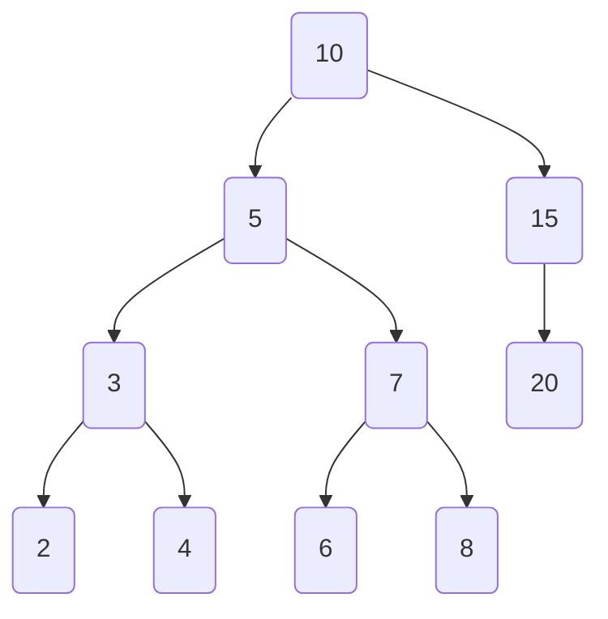

# --description--

In this project, we would create a Binary Search Tree. A binary search tree is a data structure in which each node has at most two children, with the left child containing values less than the node and the right child containing values greater than the node, allowing for efficient searching and sorting operations.

Begin by defining an empty class `TreeNode`. The `TreeNode` class represents a `node` in a binary search tree(BST).



# --hints--

You should use the `class` keyword to define a class.

```js
({ test: () => assert.match(code, /class/) })
```

Your class name should be `TreeNode`.

```js
({ test: () => assert.match(code, /class\s+TreeNode/) })
```

Don't forget to add a `:` at the end.

```js
({ test: () => assert.match(code, /class\s+TreeNode\s*:/) })
```

# --seed--

## --seed-contents--

```py
--fcc-editable-region--

--fcc-editable-region--
    pass
```

