# Translate coding challenges (如何参与课程翻译)

You don't have to know how to code to make meaningful contributions to freeCodeCamp's codebase. Follow this guide to learn how to translate freeCodeCamp's coding challenges into your language quickly and easily.

Note: At the moment we are _only_ translating the Chinese curriculum. Once we iron out the logistics with the Chinese version of our curriculum, the next languages to follow will be _Arabic, Portuguese, Russian and Spanish_ in no particular order.

## Create a GitHub account

If you don't already have an account on GitHub, go to <https://github.com/> and click the "Sign up" button in the upper right-hand corner of the page:

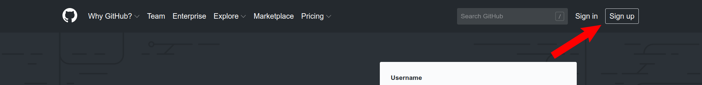

On the next page, enter in your email address and choose a username or password. Verify your account, then click the "Create account" button at the bottom of the page.

Answer the questions on the next page and click the "Complete setup" button at the bottom of the page.

Finally, check your email for a verification message from GitHub. Click the "Verify email address" button to finish creating your GitHub account.

## Fork the repository on GitHub

[Forking](https://help.github.com/articles/about-forks/) is a step where you make your own copy of freeCodeCamp's main repository (a.k.a _repo_) on GitHub.

This is essential, as it allows you to work on your own copy of freeCodeCamp on GitHub without affecting the original. Later, you will be able request that your translations be pulled from your fork of freeCodeCamp into the main freeCodeCamp repository via a pull request (PR).

**Follow these steps to fork the `https://github.com/freeCodeCamp/freeCodeCamp` repository:**

1. Go to the freeCodeCamp repository on GitHub: <https://github.com/freeCodeCamp/freeCodeCamp>

2. Click the "Fork" Button in the upper right-hand corner of the interface

3. After the repository has been forked, you will be taken to your copy of the freeCodeCamp repository at `https://github.com/YOUR_USER_NAME/freeCodeCamp`

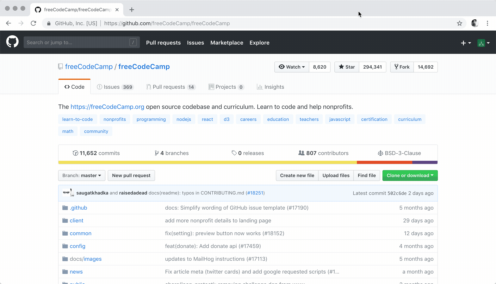

## Find a coding challenge to translate

First, check the [status](../chinese-guides/status-of-chinese-translations.md) of the curriculum's Chinese translation. Many of the challenges have already been translated.

Go to [freeCodeCamp's GitHub repository](https://github.com/freeCodeCamp/freeCodeCamp) and click on the [curriculum directory](https://github.com/freeCodeCamp/freeCodeCamp/tree/master/curriculum):

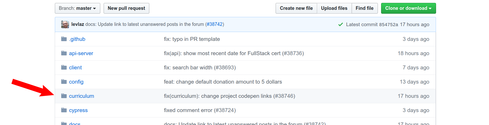

Click on the [challenges directory](https://github.com/freeCodeCamp/freeCodeCamp/tree/master/curriculum/challenges):

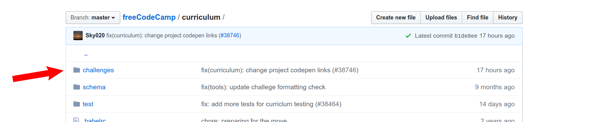

Then click on the directory for the language you will translate:

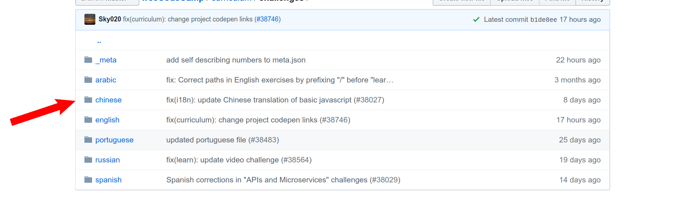

You will see a list of numbered directories for each of the current certifications:

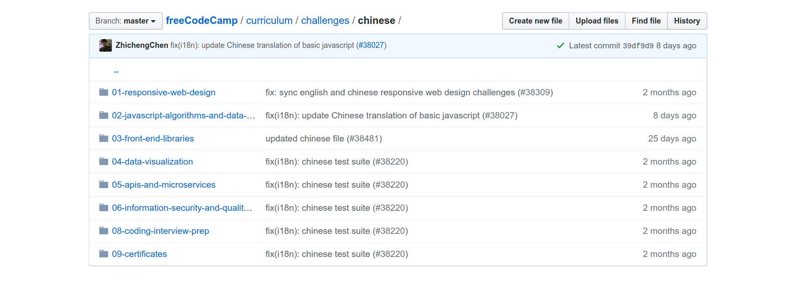

Inside of which are directories for that certification's practice challenges and required projects:

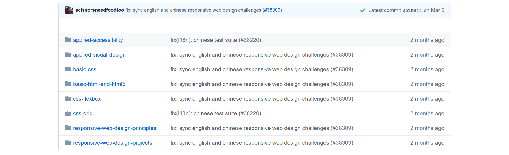

Open one of the directories and click on the markdown file for the challenge you want to translate:

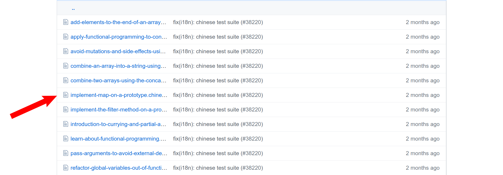

You will see the rendered markdown for that challenge:

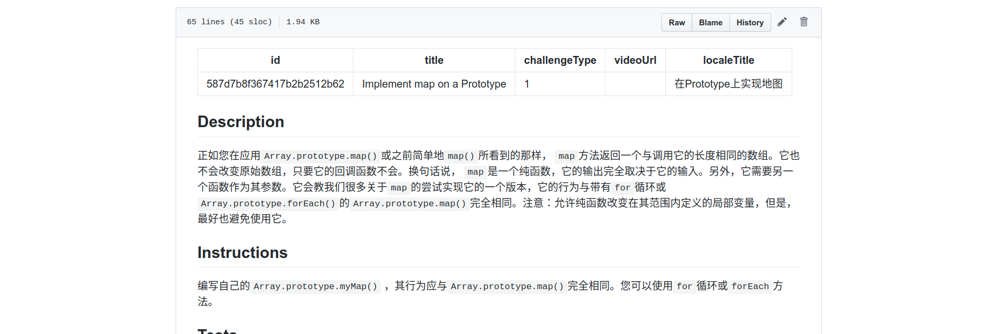

The English versions of the challenges are updated frequently to improve clarity and fix bugs. Always check the English version of the challenge before you start translating.

To quickly open the English version of the markdown file, copy the URL of the current challenge, open a new tab, and paste the URL to the address bar. Then change the two instances of the current language you're in to `english`.

For example, to open the English markdown file for the "Implement map on a Prototype" challenge, change

* <https://github.com/freeCodeCamp/freeCodeCamp/blob/master/curriculum/challenges/CURRENT_LANGUAGE/02-javascript-algorithms-and-data-structures/functional-programming/implement-map-on-a-prototype.CURRENT_LANGUAGE.md> 

to

* <https://github.com/freeCodeCamp/freeCodeCamp/blob/master/curriculum/challenges/english/02-javascript-algorithms-and-data-structures/functional-programming/implement-map-on-a-prototype.english.md>

After reviewing the English version of the challenge, go back to the markdown file you will translate and click on the <span class="octicon octicon-pencil" aria-label="The edit icon" title="The edit icon"><svg version="1.1" width="14" height="16" viewBox="0 0 14 16" class="octicon octicon-pencil" aria-hidden="true"><path fill-rule="evenodd" d="M0 12v3h3l8-8-3-3-8 8zm3 2H1v-2h1v1h1v1zm10.3-9.3L12 6 9 3l1.3-1.3a.996.996 0 011.41 0l1.59 1.59c.39.39.39 1.02 0 1.41z"></path></svg></span> button:

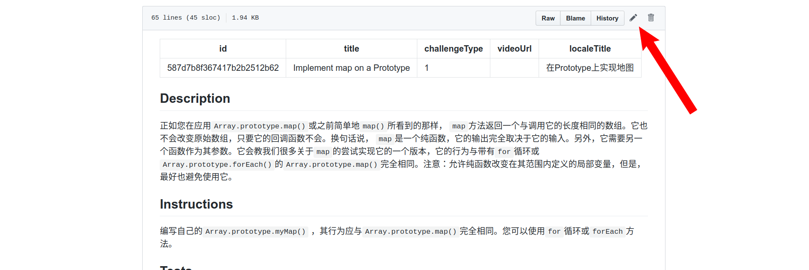

## Edit the challenge markdown file

You should now see GitHub's web editor displaying the challenge markdown file:

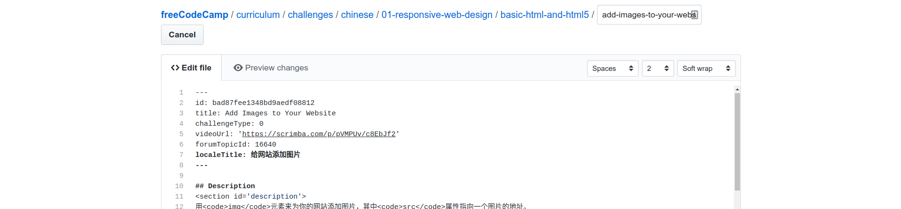

Most challenge markdown files will look similar to this:

````md
---
id: 587d7b8f367417b2b2512b62
title: Implement map on a Prototype
challengeType: 1
videoUrl: ''
localeTitle: 在Prototype上实现地图
---

## Description
<section id="description">正如您在应用<code>Array.prototype.map()</code>或之前简单地<code>map()</code>所看到的那样， <code>map</code>方法返回一个与调用它的长度相同的数组。它也不会改变原始数组，只要它的回调函数不会。换句话说， <code>map</code>是一个纯函数，它的输出完全取决于它的输入。另外，它需要另一个函数作为其参数。它会教我们很多关于<code>map</code>的尝试实现它的一个版本，它的行为与带有<code>for</code>循环或<code>Array.prototype.forEach()</code>的<code>Array.prototype.map()</code>完全相同。注意：允许纯函数改变在其范围内定义的局部变量，但是，最好也避免使用它。 </section>

## Instructions
<section id="instructions">编写自己的<code>Array.prototype.myMap()</code> ，其行为应与<code>Array.prototype.map()</code>完全相同。您可以使用<code>for</code>循环或<code>forEach</code>方法。 </section>

## Tests
<section id='tests'>

```yml
tests:
  - text: '<code>new_s</code>应该等于<code>[46, 130, 196, 10]</code> <code>new_s</code> <code>[46, 130, 196, 10]</code> 。'
    testString: assert(JSON.stringify(new_s) === JSON.stringify([46, 130, 196, 10]));
  - text: 您的代码不应使用<code>map</code>方法。
    testString: assert(!code.match(/\.map/g));

```

</section>

## Challenge Seed
<section id='challengeSeed'>

<div id='js-seed'>

```js
// the global Array
var s = [23, 65, 98, 5];

Array.prototype.myMap = function(callback){
  var newArray = [];
  // Add your code below this line

  // Add your code above this line
  return newArray;

};

var new_s = s.myMap(function(item){
  return item * 2;
});

```

</div>


</section>

## Solution
<section id='solution'>

```js
// solution required
```
</section>
````

There are three main parts of each markdown file that need to be translated: the [localeTitle](#localetitle), [Description and Instructions](#description-and-instructions), and [Test text](#test-text).

It is important not to translate any other text such as the `id`, `testString`'s, or delimiters like `<section id='instructions'>` — doing so could break the coding challenge.

There may be times when it is safe to translate text in the **Challenge Seed** section, but often you can ignore it. If a reviewer confirms that it is necessary to translate text in the Challenge Seed section, they will mention it [during their review](/chinese-guides/review-translation-prs.md).

## localeTitle

The `localeTitle` is located in the header at the top of the file:

````md
---
id: 587d7b8f367417b2b2512b62
title: Implement map on a Prototype
challengeType: 1
videoUrl: ''
localeTitle: 在Prototype上实现地图
---
````

Remember to only translate or update the text for the `localeTitle`. Changing any other text in the header may break links to helpful resources or break the coding challenge itself.

## Description and Instructions

Every challenge markdown file will include sections for the description and instructions:

````md
## Description
<section id="description">正如您在应用<code>Array.prototype.map()</code>或之前简单地<code>map()</code>所看到的那样， <code>map</code>方法返回一个与调用它的长度相同的数组。它也不会改变原始数组，只要它的回调函数不会。换句话说， <code>map</code>是一个纯函数，它的输出完全取决于它的输入。另外，它需要另一个函数作为其参数。它会教我们很多关于<code>map</code>的尝试实现它的一个版本，它的行为与带有<code>for</code>循环或<code>Array.prototype.forEach()</code>的<code>Array.prototype.map()</code>完全相同。注意：允许纯函数改变在其范围内定义的局部变量，但是，最好也避免使用它。 </section>

## Instructions
<section id="instructions">编写自己的<code>Array.prototype.myMap()</code> ，其行为应与<code>Array.prototype.map()</code>完全相同。您可以使用<code>for</code>循环或<code>forEach</code>方法。 </section>
````

When the coding challenge is rendered to freeCodeCamp, the description and instructions will appear in the pane on the left of the page:

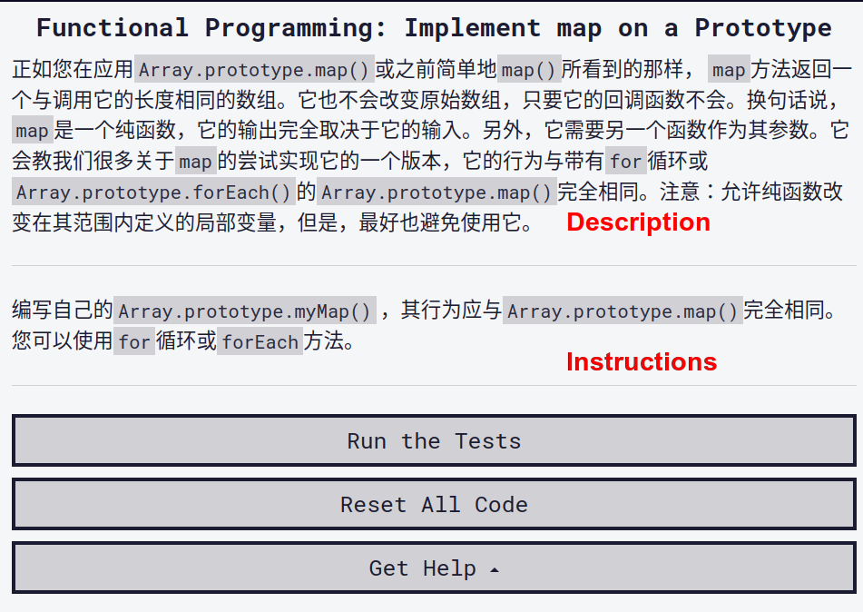

Only update the text between the `<section id='description'>...</section>` and `<section id='instructions'>...</section>` tags. Changing any other text may break the coding challenge.

There are a couple of important things to keep in mind while you translate text in the description and instructions.

### Adjust the spacing of the text

In markdown, a newline is rendered as a new paragraph. Look at the English version of the challenge and adjust the spacing of the challenge you're translating to match.

For example, the markdown for the English version of "Implement map on a Prototype" looks like this:

````md
## Description
<section id='description'>
As you have seen from applying <code>Array.prototype.map()</code>, or simply <code>map()</code> earlier, the <code>map</code> method returns an array of the same length as the one it was called on. It also doesn't alter the original array, as long as its callback function doesn't.
In other words, <code>map</code> is a pure function, and its output depends solely on its inputs. Plus, it takes another function as its argument.
It would teach us a lot about <code>map</code> to try to implement a version of it that behaves exactly like the <code>Array.prototype.map()</code> with a <code>for</code> loop or <code>Array.prototype.forEach()</code>.
Note: A pure function is allowed to alter local variables defined within its scope, although, it's preferable to avoid that as well.
</section>

## Instructions
<section id='instructions'>
Write your own <code>Array.prototype.myMap()</code>, which should behave exactly like <code>Array.prototype.map()</code>. You may use a <code>for</code> loop or the <code>forEach</code> method.
</section>
````

Your translation of the description and instructions should also match the spacing of the English version of the challenge:

````md
## Description
<section id="description">
正如您在应用<code>Array.prototype.map()</code>或之前简单地<code>map()</code>所看到的那样， <code>map</code>方法返回一个与调用它的长度相同的数组。它也不会改变原始数组，只要它的回调函数不会。
换句话说， <code>map</code>是一个纯函数，它的输出完全取决于它的输入。另外，它需要另一个函数作为其参数。
它会教我们很多关于<code>map</code>的尝试实现它的一个版本，它的行为与带有<code>for</code>循环或<code>Array.prototype.forEach()</code>的<code>Array.prototype.map()</code>完全相同。
注意：允许纯函数改变在其范围内定义的局部变量，但是，最好也避免使用它。 
</section>

## Instructions
<section id="instructions">
编写自己的<code>Array.prototype.myMap()</code> ，其行为应与<code>Array.prototype.map()</code>完全相同。您可以使用<code>for</code>循环或<code>forEach</code>方法。 
</section>
````

This will ensure that separate paragraphs are rendered properly.

### Watch out for text between code blocks and tags

Many challenge instructions and descriptions include code tags or code blocks. For example, the instructions may look similar to this:

````md
## Instructions
<section id="instructions">
编写自己的<code>Array.prototype.myMap()</code> ，其行为应与<code>Array.prototype.map()</code>完全相同。您可以使用<code>for</code>循环或<code>forEach</code>方法。 
</section>
````

Or this:

````md
## Instructions
<section id="instructions">

编写自己的`Array.prototype.myMap()` ，其行为应与`Array.prototype.map()`完全相同。您可以使用`for`循环或`forEach`方法。 

</section>
````

You usually **should not** translate text between `<code>` tags, single backticks (`), or triple backticks (```). The text between these tags or characters often refer to programming terms or specific text that the challenge will test for.

For example, if the instructions are:

````md
## Instructions
<section id='instructions'>
请把<code>h1</code>元素的内容改为：<code>Hello World</code>。
</section>
````

While the text "Hello World" is wrapped in code tags, it should not be translated. The test for that challenge is checking specifically for the English phrase "Hello World".

However, there are some exceptions. If you are not sure, do not translate the text. A [reviewer](/chinese-guides/review-translation-prs.md) will check your work and leave a comment if they confirm that it is safe to translate.

## Test text

Every coding challenge includes a test section that looks something like this:

````md
## Tests
<section id='tests'>

```yml
tests:
  - text: '<code>new_s</code>应该等于<code>[46, 130, 196, 10]</code> <code>new_s</code> <code>[46, 130, 196, 10]</code> 。'
    testString: assert(JSON.stringify(new_s) === JSON.stringify([46, 130, 196, 10]));
  - text: 您的代码不应使用<code>map</code>方法。
    testString: assert(!code.match(/\.map/g));

```
````

You only need to translate the `text`. Do not translate the `testString`.

Also, check the English version of the challenge markdown file. It's possible that the order of the tests have changed, the text was updated, or more tests were added. If that's the case, copy the tests from the English version before translating the test `text`.

## Commit your changes

After you are finished translating a challenge, scroll down to the bottom of the page where it says "Commit changes":

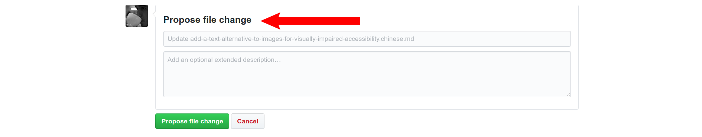

The first two sections of the form are where you enter the commit title and commit description:

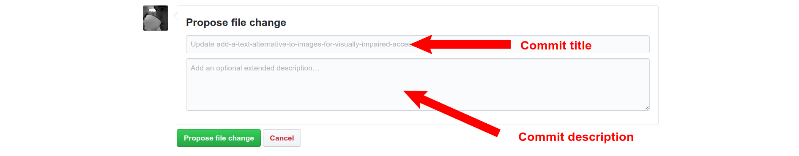

Make the title `fix(i18n): update Chinese translation`, and make the description `Update translation of (challenge title)`.

Then click the "Propose file changes" button.

## Create a pull request

You should now see the "Comparing changes" prompt:

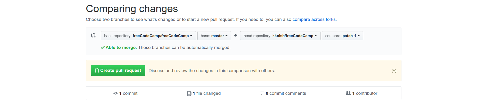

Click the "Create pull request" button.

Then you will see the "Open a pull request" prompt:

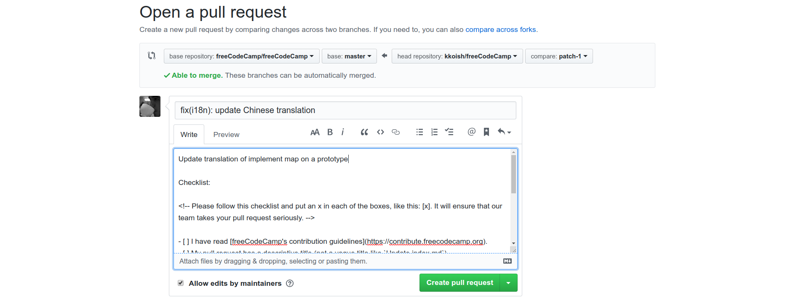

Double check that your title and description are correct, then click the "Create pull request" button.

After that, someone will review your pull request and will leave comments if they have any suggestions. When everything looks good, your pull request will be merged.

## Update a pull request

If a reviewer notices something in your pull request, they'll leave a review comment with a suggestion on how to fix the issue:


To update a pull request, open your pull request and click on the "Files changed" tab:

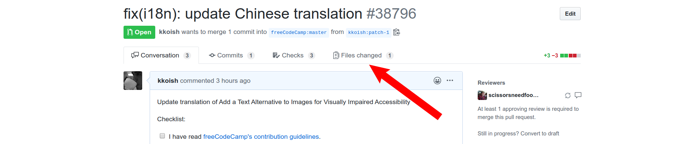

Then click on the three dots (...) and select "Edit file" from the dropdown:

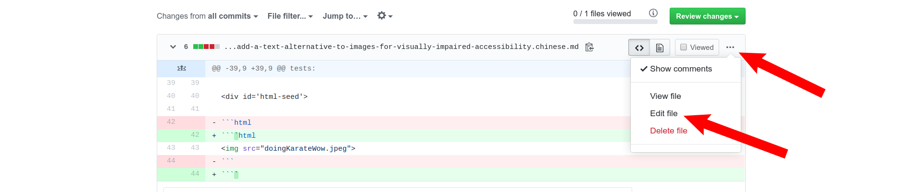

Finally, make the required changes to the markdown file.

When you're finished making changes, scroll to the bottom of the page and enter the commit title like you did before. For the commit description, briefly describe the changes you made.

Make sure that "Commit directly to `patch-n` branch." is selected, then press the "Commit changes" button:

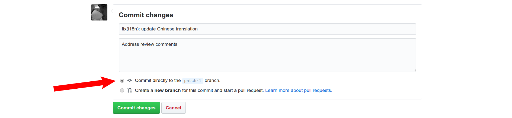

The reviewer will then be notified that your pull request was updated and will review it again. If everything looks good, your pull request will be merged. Otherwise they will leave more review comments.
