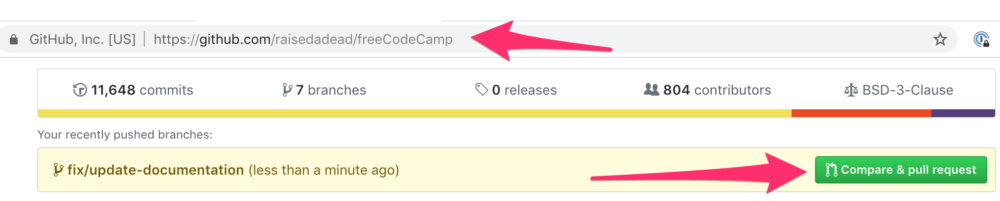
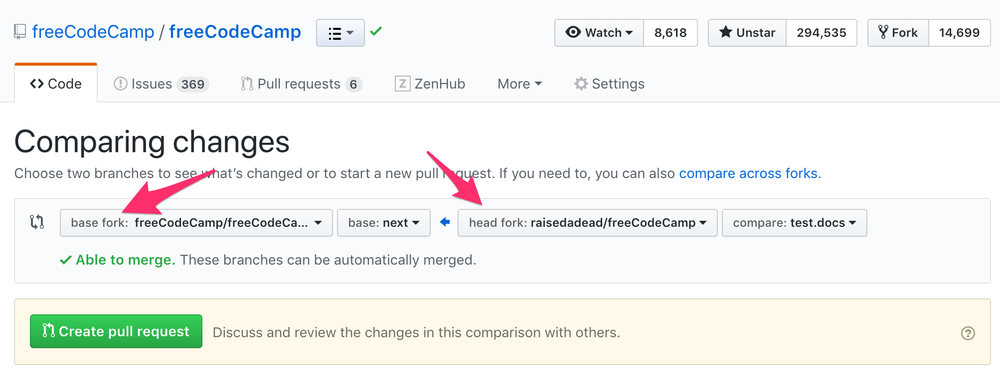

# How to open a Pull Request (PR)

A pull request enables you to send changes from your fork on GitHub to freeCodeCamp.org's main repository. Once you are done making changes to the code, or coding challenges you should follow these guidelines to send a PR.

## Prepare a good PR title

We recommend using [conventional title and messages](https://www.conventionalcommits.org/) for commits and pull request. The convention has the following format:

> `<type>([optional scope(s)]): <description>`
>
> For example:
>
> `fix(learn): tests for the do...while loop challenge`

When opening a Pull Request(PR), you can use the below to determine the type, scope (optional) and description.

**Type:**

| Type  | When to select                                                               |
| :---- | :--------------------------------------------------------------------------- |
| fix   | Changed or updated/improved functionality, tests, verbiage of a lesson, etc. |
| feat  | Only if you are adding new functionality, tests, etc.                        |
| chore | Changes that are not related to code, tests or verbiage of a lesson.         |
| docs  | Changes to `/docs` directory or the contributing guidelines, etc.            |

**Scope:**

You can select a scope from [this list of labels](https://github.com/freeCodeCamp/freeCodeCamp/labels?q=scope).

**Description:**

Keep it short (less than 30 characters) and simple, you can add more information in the PR description box and comments.

Some examples of good PRs titles would be:

- `fix(a11y): improved search bar contrast`
- `feat: add more tests to html and css challenges`
- `fix(api,client): prevent CORS errors on form submission`
- `docs(i18n): Chinese translation of local setup`

## Proposing a Pull Request

1. Once the edits have been committed, you will be prompted to create a pull request on your fork's GitHub Page.

   

2. By default, all pull requests should be against the freeCodeCamp main repo, `master` branch.

   Make sure that your Base Fork is set to freeCodeCamp/freeCodeCamp when raising a Pull Request.

   

3. Submit the pull request from your branch to freeCodeCamp's `master` branch.

4. In the body of your PR include a more detailed summary of the changes you made and why.

   - You will be presented with a pull request template. This is a checklist that you should have followed before opening the pull request.

   - Fill in the details as you see fit. This information will be reviewed and the reviewers will decide whether or not your pull request is accepted.

   - If the PR is meant to address an existing GitHub Issue then, at the end of
     your PR's description body, use the keyword _Closes_ with the issue number to [automatically close that issue if the PR is accepted and merged](https://help.github.com/en/articles/closing-issues-using-keywords).

     > Example: `Closes #123` will close issue 123

5. Indicate if you have tested on a local copy of the site or not.

   This is very important when making changes that are not just edits to text content like documentation or a challenge description. Examples of changes that need local testing include JavaScript, CSS, or HTML which could change the functionality or layout of a page.

## Feedback on pull requests

> Congratulations! :tada: on making a PR and thanks a lot for taking the time to contribute.

Our moderators will now take a look and leave you feedback. Please be patient with the fellow moderators and respect their time. All pull requests are reviewed in due course.

If you need any assistance please discuss in the [contributors chat room](https://gitter.im/FreeCodeCamp/Contributors), we are more than happy to help you.

> [!TIP]
> If you are to be contributing more pull requests, we recommend you read the [making changes and syncing](https://contribute.freecodecamp.org/#/how-to-setup-freecodecamp-locally?id=making-changes-locally) guidelines to avoid having to delete your fork.

## Conflicts on a pull request

Conflicts can arise because many contributors work on the repository, and changes can break your PR which is pending a review and merge.

More often than not you may not require a rebase, because we squash all commits, however if a rebase is requested here is what you should do.

### For usual bug fixes and features

When you are working on regular bugs and features on our development branch `master`, you are able to do a simple rebase:

1. Rebase your local copy:

   ```console
   git checkout <pr-branch>
   git pull --rebase upstream master
   ```

2. Resolve any conflicts and add / edit commits

   ```console
   # Either
   git add .
   git commit -m "chore: resolve conflicts"

   # Or
   git add .
   git commit --amend --no-edit
   ```

3. Push back your changes to the PR

   ```console
   git push --force origin <pr-branch>
   ```

### For upcoming curriculum and features

When you are working on features for our upcoming curriculum `next-*` branches, you have do a cherry pick:

1. Make sure your upstream comes in sync with your local:

   ```console
   git checkout master
   git fetch --all --prune
   git checkout next-python-projects
   git reset --hard upstream/next-python-projects
   ```

2. Take backup

   a. Either delete your local branch after taking a backup (if you still have it locally):

      ```console
      git checkout <pr-branch-name>

      # example:
      # git checkout feat/add-numpy-video-question

      git checkout -b <backup-branch-name>

      # example:
      #  git checkout -b backup-feat/add-numpy-video-question

      git branch -D <pr-branch-name>
      ```

   b. Or just a backup of your pr branch (if you do not have it locally):

      ```console
      git checkout -b <backup-branch-name> origin/<pr-branch-name>

      # example:
      #  git checkout -b backup-feat/add-numpy-video-question origin/feat/add-numpy-video-question
      ```

4. Start off with a clean slate:

   ```console
   git checkout -b <pr-branch-name> next-python-projects
   git cherry-pick <commit-hash>
   ```

5. Resolve any conflicts, and cleanup, install run tests

   ```console
   npm run clean

   npm ci
   npm run test:curriculum --superblock=<superblock-name>

   # example:

   # npm run test:curriculum --superblock=python-for-everybody

   ```

6. If everything looks good push back to the PR

   ```console
   git push --force origin <pr-branch-name>
   ```
