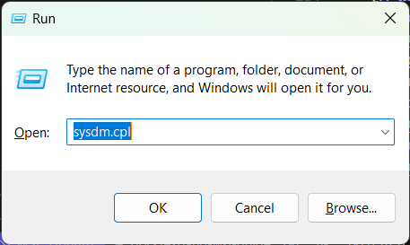
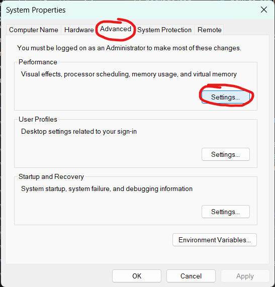
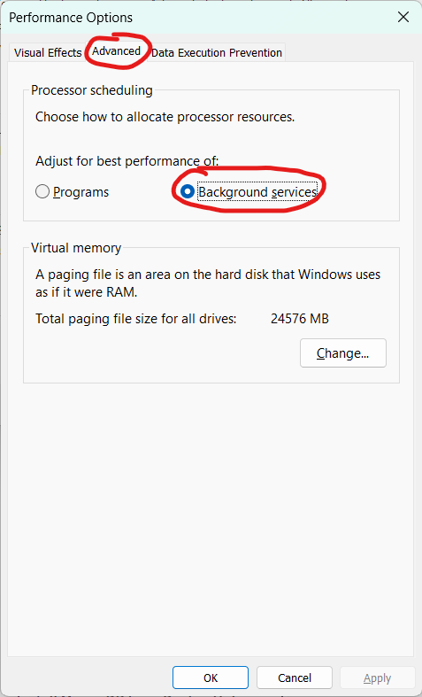
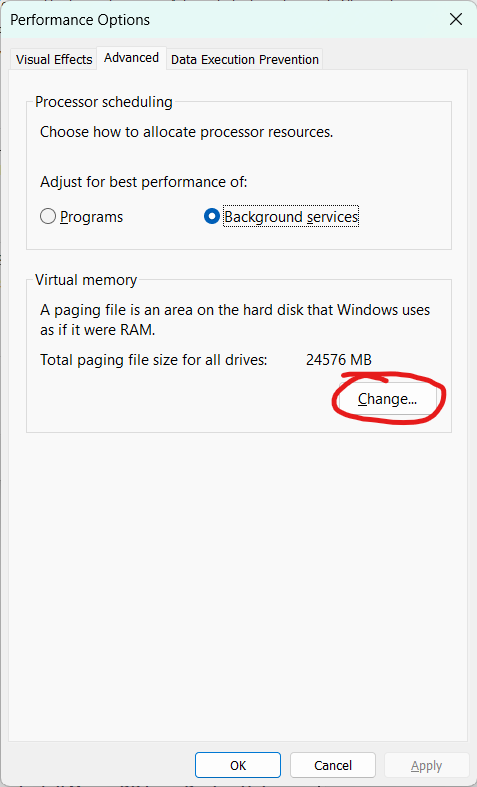
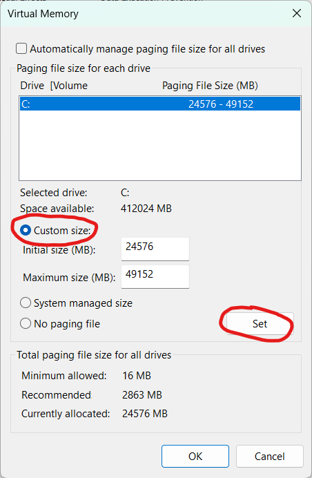

# Set up freeCodeCamp on Windows Subsystem for Linux (WSL)

> [!NOTE]
> Before you follow these instructions make sure your system meets the requirements.
>
> **WSL 2**: Windows 10 64-bit (Version 2004, Build 19041 or higher) - available for all distributions including Windows 10 Home.
>
> **Docker Desktop for Windows**: See respective requirements for [Windows 10 Pro](https://docs.docker.com/docker-for-windows/install/#system-requirements) and [Windows 10 Home](https://docs.docker.com/docker-for-windows/install-windows-home/#system-requirements)

This guide covers some common steps with the setup of WSL2. Once some of the common issues with WSL2 are addressed, you should be able to follow [this local setup guide](how-to-setup-freecodecamp-locally.md) to work with freeCodeCamp on Windows running a WSL distro like Ubuntu.

## Enable WSL

Follow the instructions on the [official documentation](https://docs.microsoft.com/en-us/windows/wsl/install-win10) to install WSL2.

## Install Ubuntu

1. We recommended using Ubuntu-18.04 or above with WSL2.

   > [!NOTE]
   >
   > While you may use other non-Debian-based distributions, they all come with their own 'gotchas' that are beyond the scope of this guide.

   As of November 2023, Ubuntu and Debian are the only Linux distributions [officially supported by Playwright](https://playwright.dev/docs/intro#system-requirements), the end-to-end testing library used by freeCodeCamp.

2. Update the dependencies for the OS

   ```console
   sudo apt update
   sudo apt upgrade -y

   # cleanup
   sudo apt autoremove -y
   ```

## Set up Git

Git comes pre-installed with Ubuntu 18.04, verify your Git version with `git --version`.

```output
~
❯ git --version
git version 2.25.1
```

(Optional but recommended) You can now proceed to [setting up your ssh keys](https://help.github.com/articles/generating-an-ssh-key) with GitHub.

## Installing a Code Editor

We highly recommend installing [Visual Studio Code](https://code.visualstudio.com) on Windows 10. It has great support for WSL and automatically installs all the necessary extensions on your WSL distribution.

Essentially, you will edit and store your code on Ubuntu-18.04 with VS Code installed on Windows.

If you use [IntelliJ Idea](https://www.jetbrains.com/idea/), you may need to update your Node interpreter and npm package manager to what is installed on your WSL distro.

You can check these settings by going to Settings > Languages & Frameworks > Node.js and npm.

## Installing Docker Desktop

**Docker Desktop for Windows** allows you to install and run databases like MongoDB and other services like NGINX and more. This is useful to avoid common pitfalls with installing MongoDB or other services directly on Windows or WSL2.

Follow the instructions on the [official documentation](https://docs.docker.com/docker-for-windows/install) and install Docker Desktop for your Windows distribution.

There are some minimum hardware requirements for the best experience.

## Configure Docker Desktop for WSL

Once Docker Desktop is installed, [follow these instructions](https://docs.docker.com/docker-for-windows/wsl) and configure it to use the Ubuntu-18.04 installation as a backend.

This makes it so that the containers run on the WSL side instead of running on Windows. You will be able to access the services over `http://localhost` on both Windows and Ubuntu.

## Install MongoDB from Docker Hub

Once you have configured Docker Desktop to work with WSL2, follow these steps to start a MongoDB service:

1. Launch a new Ubuntu-18.04 terminal

2. Pull `MongoDB 4.4.x` from Docker Hub

   ```console
   docker pull mongo:4.4
   ```

3. Start the MongoDB service at port `27017`, and configure it to run automatically on system restarts

   ```console
   docker run -it \
     -v mongodata:/data/db \
     -p 27017:27017 \
     --name mongodb \
     --restart unless-stopped \
     -d mongo:4.4
   ```

4. You can now access the service from both Windows or Ubuntu at `mongodb://localhost:27017`.

## Installing Node.js and pnpm

We recommend you install the LTS release for Node.js with a node version manager - [nvm](https://github.com/nvm-sh/nvm#installing-and-updating).

Once installed use these commands to install and use the Node.js version as needed

```console
nvm install --lts

# OR
# nvm install <version>

nvm install 20.9

# Usage
# nvm use <version>

nvm use 20.9
```

Node.js comes bundled with `npm`, which you can use to install `pnpm`:

```console
npm install -g pnpm
```

## Set up freeCodeCamp Locally

Now that you have installed the pre-requisites, follow [our local setup guide](how-to-setup-freecodecamp-locally.md) to clone, install and set up freeCodeCamp locally on your machine.

> [!WARNING]
>
> Please note, at this time the setup for Cypress tests (and related GUI needs) is a work in progress. You should still be able to work on most of the codebase.

## Optimize Windows and WSL

   > [!NOTE]
   >
   > The following tips were collected from across the web and have not gone through vigorous testing. Your mileage may vary.

### Adjust processer scheduling for background services

This may reduce incidents of Docker containers crashing due to lack of resources.

Open the System Properties control panel by pressing <kbd>Win + R</kbd> and entering `sysdm.cpl`



Go to Advanced -> Performance -> Settings…



Under Advanced -> Processor scheduling, choose "Background services". Do not close the window. Continue to the next tip.



### Increase the size of Windows paging file for the system drive

Under Advanced -> Virtual memory, click "Change…"



Choose "Custom size". Set the initial size to 1.5x and the maximum size to 3x of your physical memory. Then click "Set".



### Increase the size of memory allocated to WSL

Create a [`.wslconfig` file](https://learn.microsoft.com/en-us/windows/wsl/wsl-config#configuration-setting-for-wslconfig) in your [`%UserProfile%` directory](https://learn.microsoft.com/en-us/windows/wsl/wsl-config#wslconfig) (typically `C:\Users\<UserName>\.wslconfig`) with the following content (assuming 16GB of physical memory):

```ini
# Settings apply across all Linux distros running on WSL 2
[wsl2]

# Limits VM memory to use no more than 12 GB, this can be set as whole numbers using GB or MB
memory=12GB

# Sets amount of swap storage space to 8GB, default is 25% of available RAM
swap=8GB
```

### Increase Node.js max old space size

This fixes the ["JavaScript heap out of memory" error](https://stackoverflow.com/a/54456814) with ESLint. Add the following to your `~/.bashrc` or `~/.zshrc`:

```sh
export NODE_OPTIONS="--max-old-space-size=4096"
```

### Avoid `pnpm run test`

Instead, use the script [appropriate to your PR](https://forum.freecodecamp.org/t/wsl-performance-issues-while-working-on-the-codebase/644215/2#:~:text=usually%2C%20you%20just%20want%20to%20test%20something%20specific%20to%20either%20the%20curriculum%20or%20the%20client%20or%20the%20api%20-%20almost%20never%20all%203.); either `pnpm run test:api`, `pnpm run test:curriculum`, or `pnpm run test-client`.

## Useful Links

- [A WSL2 Dev Setup with Ubuntu 20.04, Node.js, MongoDB, VS Code, and Docker](https://hn.mrugesh.dev/wsl2-dev-setup-with-ubuntu-nodejs-mongodb-and-docker) - an article by Mrugesh Mohapatra (Staff Developer at freeCodeCamp.org)
- Frequently asked questions on:
  - [Windows Subsystem for Linux](https://docs.microsoft.com/en-us/windows/wsl/faq)
  - [Docker Desktop for Windows](https://docs.docker.com/docker-for-windows/faqs)
