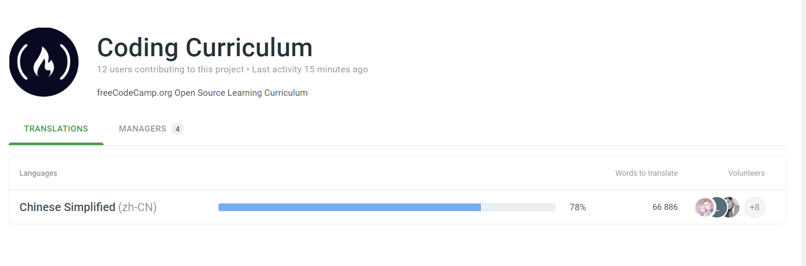
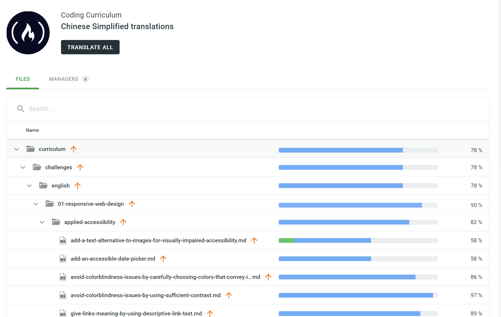
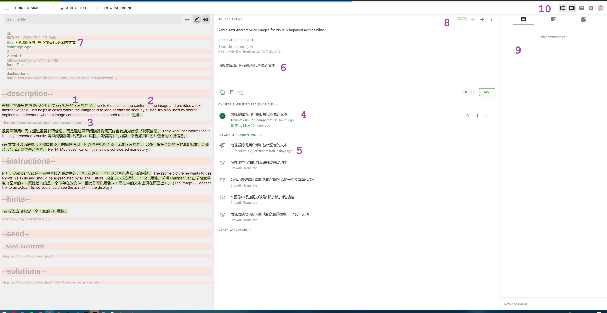

# How to Translate a File

> [!NOTE]
> All translations are handled through https://translate.freecodecamp.org - we are no longer using GitHub to translate files directly.

To begin, head to our translation website and login (if you have not contributed to translations before, you will need to create an account).

## Select a Project and File

You should see two "projects" available for translation: The `Contributing Documentation` project, which contains the files for this documentation site, and the `Coding Curriculum` project, which contains our challenge files for `/learn`.

Select which project you want to contribute to, and you will see a list of available languages for translation.

Select the language you want to work on, and you will see the complete file tree.

Each file and folder will show a progress bar. The **blue** portion of the progress bar indicates what percentage of the file has been translated, while the **green** portion of the progress bar indicates what percentage of the file has been approved by the proofreading team.

Select a file to work on and Crowdin will open the editor view.

> [!NOTE]
> When the editor view opens, you will need to click the settings icon (shown as a gear) and switch the 'HTML Tags Displaying' setting to 'Show'. This will ensure you can see tags such as `<code></code>` instead of `<0></0>`.

## Translate the File

Crowdin separates a document into translatable "strings", usually sentences. Each string is translated individually. Referring to the image above:

1. A string highlighted in green already has a proposed translation.
2. A string highlighted in red does _not_ have a proposed translation.
3. A string with greyed out text is not translatable. This is the case for code blocks and other content that must not be translated. You will be unable to select these strings in the editor.
4. If a contributor has proposed a translation to a string, Crowdin will display those proposals here. You will not be able to save an identical translation - instead, if a translation is accurate, you should click the `+` icon to "upvote" it. An inaccurate translation can be "downvoted" with the `-` icon.
5. Crowdin will recommend translations based on Translation Memory (TM) or Machine Translation (MT). Translation Memory refers to similar or identical strings that we have translated/approved in other files. Machine Translation refers to translations recommended by their integrated library.
6. This is the editor pane, where you may write your proposed translation for the selected string.
7. The currently selected string in the editor will be highlighted in yellow.
8. Here you will see tags indicating the state of the string. `Done` means the string has at least one proposed translation. `Todo` means the string does not have any proposed translations.
9. Here you can see the comments window. If you have questions or concerns about a particular string, you can leave a comment on the string here for other translators to see.
10. These two "pane" buttons will hide the left (document) and right (comments) views.

> [!NOTE]
> If you see a hidden string that includes translations, please notify us in the [translators chat room](https://chat.freecodecamp.org/channel/translators) so we can remove the translation from memory.

When you have completed a translation for a string, select the `Save` button to store your translation on Crowdin. Other contributors will then be able to vote on your translation and proofreaders will be able to approve it.

You are welcome to translate as many strings as you like - there are no additional steps required when you complete a full file or propose a new translation. Clicking the `Save` button is all that is needed to store a translation.

> [!NOTE]
> If you see something in the English source file that is inaccurate or incorrect, please do not fix it through the translation flow. Instead, leave a comment on the string to notify us that there is a discrepancy, or create a GitHub issue.

### Translating Documentation

Translating our contributing documentation is a similar flow to translating our curriculum files.

> [!NOTE]
> Our contributing documentation is powered by `docsify`, and we have special parsing for message boxes like this one. If you see strings that start with `[!NOTE]`, `[!WARNING]`, or `[!TIP]`, these words should NOT be translated.

## Rate Translations

Crowdin allows you to rate the existing proposed translations. If you attempt to save a translation, you may see a message indicating that you cannot save a duplicate translation - this means another contributor has proposed that identical translation. If you agree with that translation, click the `+` button to "upvote" the translation.

If you see a translation that is inaccurate or does not provide the same clarity as the original string, click the `-` button to "downvote" the translation.

Crowdin uses these votes to give a score to each proposed translation for a string, which helps the proofreading team determine which translation is the best fit for each string.

## Quality Assurance Checks

We have enabled some quality assurance steps that will verify a translation is as accurate as possible - this helps our proofreaders review proposed translations.

When you attempt to save a translation, you may see a warning message appear with a notification regarding your proposed translation.

This message appears when Crowdin's QA system has identified a potential error in the proposed translation. In this example, we have modified the text of a `<code>` tag and Crowdin has caught that.

> [!WARNING]
> You have the option to save a translation in spite of errors, but this should be done only in circumstances where the error is incorrect. If you are clicking "Save Anyway", you should also tag a proofreader or project manager in a comment on that string for further review. Include the reason why you have saved the translation with QA errors.

## Translation Best Practices

Follow these guidelines to ensure our translations are as accurate as possible:

- Do not translate the content within `<code>` tags. These tags indicate text that is found in code and should be left in English.
- Do not add additional content. If you feel a challenge requires changes in the text content or additional information, you should propose the changes through a GitHub issue or a pull request that modifies the English file.
- Do not change the order of content.

If you have any questions, feel free to reach out to us in our [translators chat room](https://chat.freecodecamp.org/channel/translators) and we will be happy to assist you.
