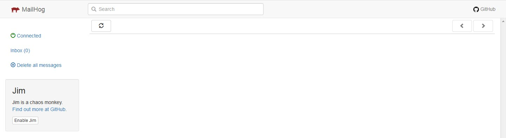
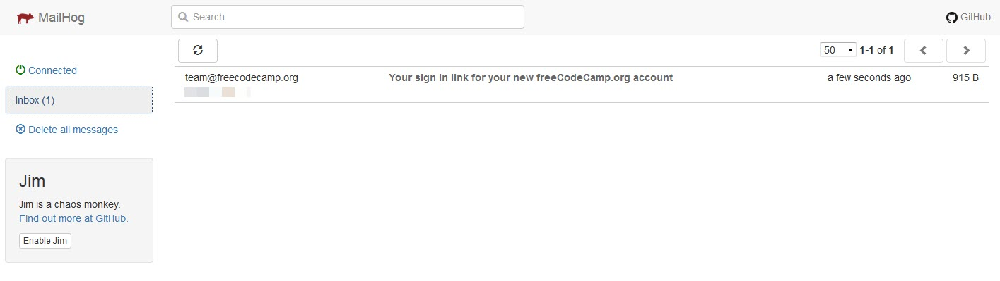
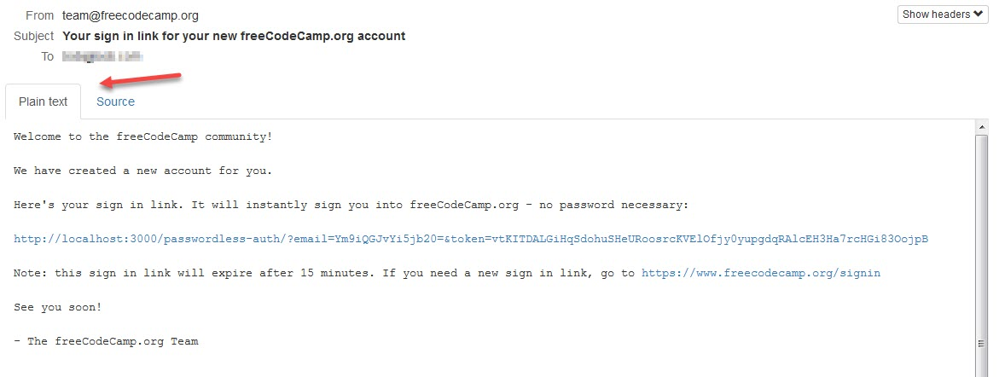

<table>
    <tr>
        <!-- Do not translate this table -->
        <td> Read these guidelines in </td>
        <td><a href="/CONTRIBUTING.md"> English </a></td>
        <td><a href="/docs/chinese/CONTRIBUTING.md"> 中文 </a></td>
        <td><a href="/docs/russian/CONTRIBUTING.md"> русский </a></td>
        <td><a href="/docs/arabic/CONTRIBUTING.md"> عربي </a></td>
        <td><a href="/docs/spanish/CONTRIBUTING.md"> Español </a></td>
        <td><a href="/docs/portuguese/CONTRIBUTING.md"> Português </a></td>
    </tr>
</table>

# Как поймать исходящие электронные письма локально (для рабочих процессов электронной почты)

> **Заметка:** Это **необязательный** шаг - требуется только при работе с рабочими процессами электронной почты

## Вступление

Некоторые рабочие процессы электронной почты, такие как обновление электронной почты пользователя, требуют, чтобы внутренний сервер api отправлял электронные письма. Во время разработки вы можете использовать инструмент для отлавливания электронной почты локально, вместо того, чтобы использовать поставщика электронной почты и отправлять фактическое электронное письмо. MailHog - это один из таких средств тестирования электронной почты для разработчиков, который поймает электронные письма, которые отправляет ваш местный экземпляр freeCodeCamp.

## Установка MailHog

Как вы устанавливаете и запускаете MailHog, зависит от вашей ОС


- [Установка MailHog на macOS](#installing-mailhog-on-macos)
- [Установка MailHog на Windows](#installing-mailhog-on-windows)
- [Установка MailHog на Linux](#installing-mailhog-on-linux)

### Установка MailHog на macOS

 
Как установить MailHog на macOS с помощью [Homebrew](https://brew.sh/):


```bash
brew install mailhog
brew services start mailhog
```


Это запустит службу почтового ящика в фоновом режиме.

Затем вы можете перейти к [использованию MailHog](#using-mailhog).

### Установка MailHog на Windows

Загрузите последнюю версию MailHog с [официального репозитория MailHog](https://github.com/mailhog/MailHog/releases). Нажмите на ссылку для вашей версии Windows (32 или 64 бит) и файл .exe будет загружен на ваш компьютер.

После завершения загрузки, нажмите на файл. Вероятно, вы получите уведомление брандмауэра Windows, где вам нужно будет разрешить доступ к MailHog. Как только вы это сделаете, стандартная подсказка командной строки Windows откроется с уже запущенным MailHog.

Чтобы закрыть MailHog, закройте командную строку. Чтобы запустить его снова, щелкните тот же .exe-файл. Вам не нужно загружать новый.

Затем вы можете перейти к [использованию MailHog](#using-mailhog).

### Установка MailHog на Linux

Сначала установите [Go](https://golang.org).

Для систем на базе Debian, таких как Ubuntu и Linux Mint, выполните:


```bash
sudo apt-get install golang
```


Для CentOS, Fedora, Red Hat Linux, и других систем на базе RPM, запустите:


```bash
sudo dnf install golang
```

Или:

```bash
sudo yum install golang
```


Задайте путь к Go:

```bash
echo "export GOPATH=$HOME/go" >> ~/.profile
echo 'export PATH=$PATH:/usr/local/go/bin:$GOPATH/bin' >> ~/.profile
source ~/.profile
```

Затем установите и запустите MailHog:

```bash
go get github.com/mailhog/MailHog
sudo cp /home/$(whoami)/go/bin/MailHog /usr/local/bin/mailhog
mailhog
```


Далее, вы можете перейти к [использованию MailHog](#using-mailhog).

## Использование MailHog

После того, как вы установили MailHog и запустили его, вам нужно открыть почтовый ящик MailHog в вашем браузере, открыть новую вкладку или окно и перейти на [http://localhost:8025](http://localhost:8025). 
Теперь вы должны увидеть экран, как показано ниже:



Когда ваша установка freeCodeCamp отправит электронное письмо, вы увидите, что оно появляется здесь. Как показано ниже:



Откройте письмо, и вы увидите две вкладки, где вы можете просмотреть содержимое - обычный текст и исходник. Убедитесь, что вы находитесь на вкладке обычного текста.



Любые ссылки в письме должны быть кликабельны.

## Полезные ссылки

- По любым другим вопросам, связанным с MailHog или инструкциями по пользовательским настройкам, проверьте репозиторий [MailHog](https://github.com/mailhog/MailHog).

