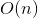

## Dynamic Programming

Dynamic Programming(DP) is a programming technique for solving problems where the computations of its subproblems overlap: you write your program in a way that avoids recomputing already solved problems.
This technique, it's usually applied in conjunction with memoization which is an optimization technique where you cache previously computed results, and return the cached result when the same computation is needed again.

An example with Fibonacci's series which is defined as:

```F(N) = F(N-1) + F(N-2)```
with seed values [[1]](https://en.wikipedia.org/wiki/Fibonacci_number)

```F(1) = 1 and F(0) = 0```

Note that there are alternative seed values of

```F(1) = 1 and F(2) = 1```

The recursive relationship computes the 5th Fibonacci number as [[2]](https://en.wikipedia.org/wiki/Dynamic_programming#Fibonacci_sequence)  
1. `F(5)`
2. `fib(4) + fib(3)`
3. `(fib(3) + fib(2)) + (fib(2) + fib(1))`
4. `[(fib(2) + fib(1)) + (fib(1) + fib(0))] + [(fib(1) + fib(0)) + fib(1)]`
5. `[{(fib(1) + fib(0)) + fib(1)} + (fib(1) + fib(0))] + [(fib(1) + fib(0)) + fib(1)]`

The alternating parantheses are added to clarify the relationship

`F(5)` in tree form:


To compute `F(5)` it will need to compute many times the same `F(i)`. Using recursion:

```python
def fib(n)
{
    if n <= 1:
        return n
    return fib(n-1) + fib(n-2);
}
```

And below is the optimised solution (using DP)

For `F(5)`, this solution will generate the calls depicted in the image above, running in .

Here is an optimised solution which uses DP and memoization:

```python
lookup = {1 : 1, 2 : 1} # Create a lookup-table (a map) inizialized with the first 2 Fibonacci's numbers

def fib(n)
{
    if n in lookup: # If n is already computed
        return n # Return the previous computed solution
    else 
        lookup[n] = fib(n-1) + fib(n-2) # Else, do the recursion.
    return lookup[n]
}
```
Caching computed solutions in a lookup table, and query it before go recursion will let the program have a running time of .

#### More Information:

- [What is dynamic programming on StackOverflow](https://stackoverflow.com/questions/1065433/what-is-dynamic-programming")
- [Difference between memoization and DP on StackOverflow](https://stackoverflow.com/questions/6184869/what-is-the-difference-between-memoization-and-dynamic-programming)
- [Why DP rather than function calling or looping](https://www.quora.com/What-is-the-difference-between-dynamic-programming-and-recursion)

#### References:
1. [Fibonacci number](https://en.wikipedia.org/wiki/Fibonacci_number)
2. [Dynamic Programming](https://en.wikipedia.org/wiki/Dynamic_programming#Fibonacci_sequence)
